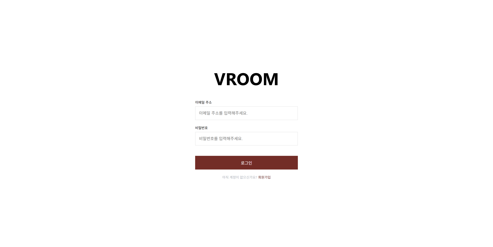

## 프로젝트 소개
VROOM은 실시간 채팅 웹 애플리케이션입니다.

---

## 실행 화면
|              로그인 화면              |              회원가입 화면              |
|:--------------------------------:|:---------------------------------:|
|  |  |

|              메인 화면              |             나의 채팅방 목록              |
|:-------------------------------:|:----------------------------------:|
|  |  |

|               채팅방               |              친구 추가               |
|:-------------------------------:|:--------------------------------:|
|  |  |

|           채팅방 생성            |               나의 채팅방 목록               |
|:---------------------------:|:-------------------------------------:|
|  |  |

|             팔로워 목록              |              팔로잉 목록              |
|:-------------------------------:|:--------------------------------:|
|  |  |

---

## 기술 스택
### Frontend

### Backend

---

## ERD

